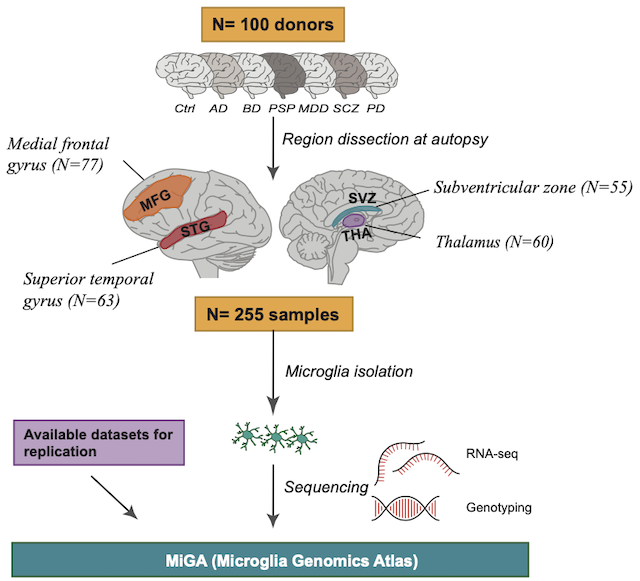

## Omics analysis for Microglia project

> This repository includes code and plots. Exploratory analysis and intermediate processing files are too large for this repository.

> Full nominal and permuted eQTL and sQTL summary statistics per brain region are available from Zenodo at https://doi.org/10.5281/zenodo.4118605 (eQTL) and https://doi.org/10.5281/zenodo.4118403 (sQTL). Results for eQTL and sQTL meta-analysis (mashR and METASOFT) and colocalization (COLOC) are available from Zenodo at https://doi.org/10.5281/zenodo.4118676. Allelic information for all QTL analyses is available from Zenodo at https://doi.org/10.5281/zenodo.4301005.

***************************************
Differential expression analysis for different DIAGNOSIS
***************************************
Using Dream: 
 - [Depression x CT](https://rajlabmssm.github.io/MiGA_public_release/DE_diagnosis/deg_depressionxct_dream.html). Depression = 74 samples, Control = 96 samples. 

 - [Dementia x CT](https://rajlabmssm.github.io/MiGA_public_release/DE_diagnosis/deg_dementiaxct_dream.html). Dementia = 15 samples, Control = 96 samples. 

